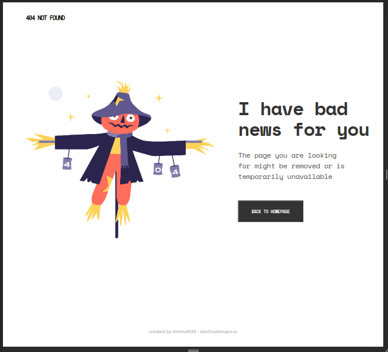
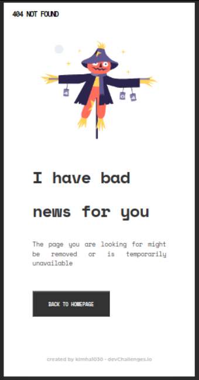

<!-- Please update value in the {}  -->

<h1 align="center">404 NOT FOUND</h1>

   Solution for a challenge from  <a href="http://devchallenges.io" target="_blank">Devchallenges.io</a>.

  <h3>
    <a href="https://project404notfound-a459d.web.app/">
      Demo
    </a>
     | 
    <a href="https://devchallenges.io/challenges/wBunSb7FPrIepJZAg0sY">
      Challenge
    </a>
  </h3>

<!-- TABLE OF CONTENTS -->

## Table of Contents

- [Overview](#overview)
  - [Built With](#built-with)
- [Features](#features)
- [Contact](#contact)
- [Acknowledgements](#acknowledgements)

<!-- OVERVIEW -->

## Overview

### - Desktop

### - Mobile

This is the first challenge of the Responsive Web Designer path. Really, it was a great experience because although it was a short project, I decided not to use any framework and to do it only with HTML and CSS.
Also, I was able to learn how to deploy in Firebase.

### Built With

- HTML
- CSS

## Features

This application/site was created as a submission to a [DevChallenges](https://devchallenges.io/challenges) challenge. The [challenge](https://devchallenges.io/challenges/wBunSb7FPrIepJZAg0sY) was to build an application to complete the given user stories.

## Acknowledgements

- [Steps to replicate a design with only HTML and CSS](https://devchallenges-blogs.web.app/how-to-replicate-design/)
- [Desplegar proyectos estaticos con Firebase hosting](https://www.youtube.com/watch?v=4Qdg6m_naxg)

## Contact

- GitHub [@kimha1030](https://{github.com/kimha1030})
- Twitter [@H1030Kimberly](https://{twitter.com/H1030Kimberly})
- Linkedin [linkedin.com/in/kimhza/](https://www.linkedin.com/in/kimhza/)
